<h1 align="left">Holla Amigos !</h1>

Holla!
I'am Kresna. In this digital era, technology industry always evolving. From static to dynamic, from desktop to mobile. Why mobile?
Because people nowadays always carry their mobile phone. That's why responsive design in this digital era is important to uplifting and improve engagement for entrepreneur. 

The purpose of this website is inform people or hiker about official track for several mountain and also sharing stories about outdoor activity

## WEBSITE STRUCTURE

- Header
  - Navbar
- Main
  - Banner section
  - Tracking and Stories Section
  - Gallery section
  - Contact section
    - Form

## SECRET RECIPE
- HTML
- CSS
- JavaScript
- External/Internal Source
  - Icon
  - Image
  - BBImages

Note*: 
- VANILLA JS, CSS ARE USED. The power of Vanilla

## Source Versioning
We use source versioning for separate between main repo and branch for accessibility, security and also avoid conflict at an project

### Branch
<ol>
<li>Create branch from main using "GIT CHECKOUT -B BRANCH_NAME"   

</li>
<li>After new branch created, we check the status of new branch using "GIT STATUS". It will give information about current branch   

</li>
<li>Now we must pull latest source from MAIN using "GIT PULL ORIGIN MAIN". 

</li>
</ol>

### Pull Request
After we do editing some files and pushing to new branch, now we do pull request before merge to main. The function of Pull Request is protect main repo from conflict and also the reviewer can do review the code about quality, syntax, variable and etc<br 
<ol>
<li>As collaborator, from main repository, choose the custom branch and select pull request 

</li>
<li>Give description about the code change include addition or deletion code or improvement. And your pull request success created

</li>
<li>As review, you can review the pull request and if reviewer opinion is good, the reviewer can do merging code from branch to main branch using Confirm Merge button

</li>
</ol>

## Deployment
>### NETLIFY
<ol>
<li>You need to login netlify account. You can login using several methods. In this case, i used Github account
</li>
<li>You will redirect to Github login page. Fill the username / email and password fill and then Sign In
</li>
<li>You will redirect to Dashboard Page. Select SITE menu at sidebar to add New Site. And then choose Add new Site. In this example, i used import from existing project because the project for deployment came from Github.

</li>
<li>Choose the repository from Github for deployment. And then select Deploy

</li>
<li>Deployment process will be proceed automatically. You can see the deployment status at the Site Overview page. If deployment success, you'll get the default web address from netlify.

</li>
<li>If you wanna change the site name, go to Site Configuration and choose Change site name 

</li>
<li>Customize your site name, and then Save. Your site name will be replace 

</li>
<li>Now at your browser, go to your custom site name. And your website now go live using netlify

</li>
</ol>
 

> ### NIAGAHOSTER
<ol>
<li>First signup to Niagahoster. After that choose the product. In this cases, i use domain product for week 4 assignment

</li>
<li>Check your domain name to checking availbility of your website name. In this case, i use jejakjejaka for my website name

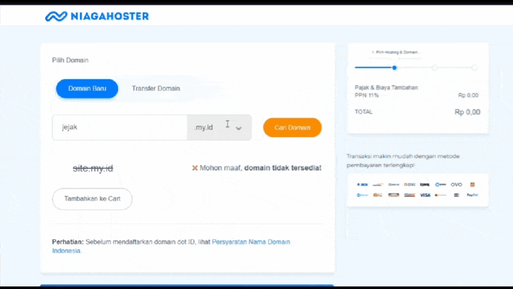

</li>
<li>If your site name available, you can check the domain and also the price. Choose what do you want. In this case, i use .site domain

</li>
<li>Choose the product service. In this case, only buy domain

</li>
<li>Choose the payment method. I use QRIS method for easier payment

</li>
<li>You will be get modal notification for input your profile. 

</li>
<li>After fill the profile modal, you'll go to payment page. For QRIS, the QR image will be shown. Just follow the instruction 

</li>
<li>And voila. Your website ready to live 

</li>

</ol>
 

> ### CLOUDFLARE
<ol>
<li>First signup to Cloudflare. You can use existing email and set the password. You'll receive confirmation email from Cloudflare

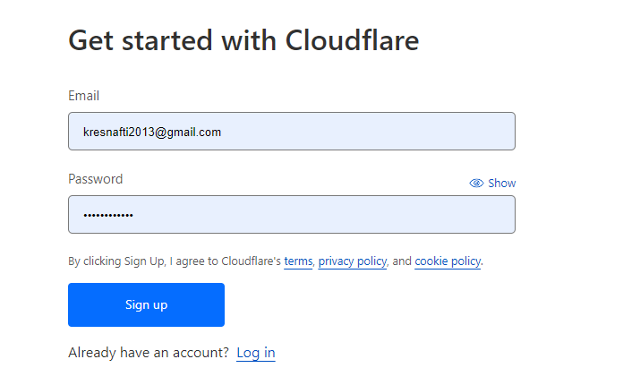

</li>
<li>After receive email from Cloudflare and email verification, you can login using email and password that you've registered before. When login success, you'll be redicreting to Cloudflare dashboard

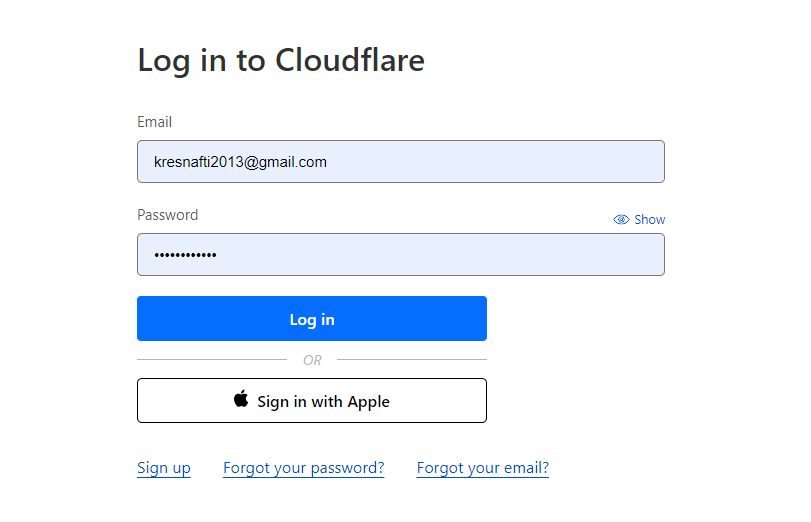

</li>
<li>Register your site to Cloudfare

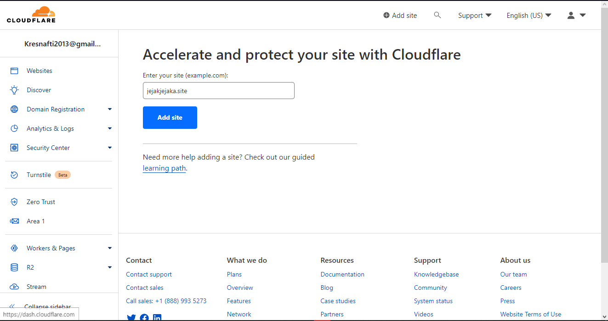

</li>
<li>For assignment week 4, choose Free feature

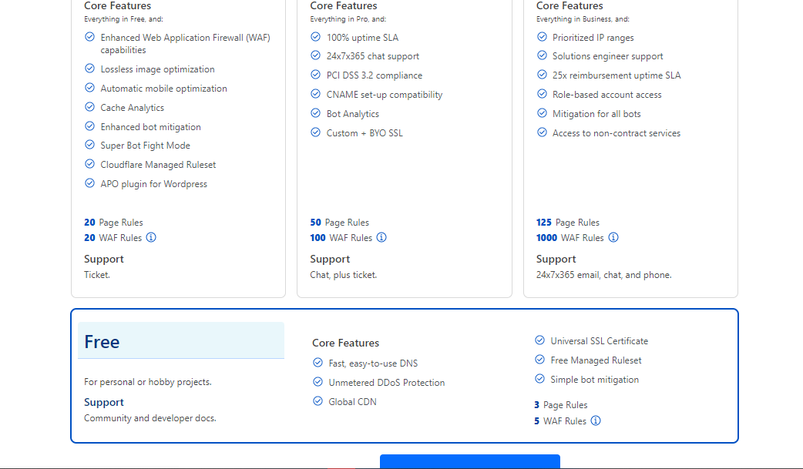

</li>
<li>At this section, pay attention to point 2. Because Nameserver 1 and 2 is important. Because it needs registered at niagahoster domain server. So we move to Niagahoster

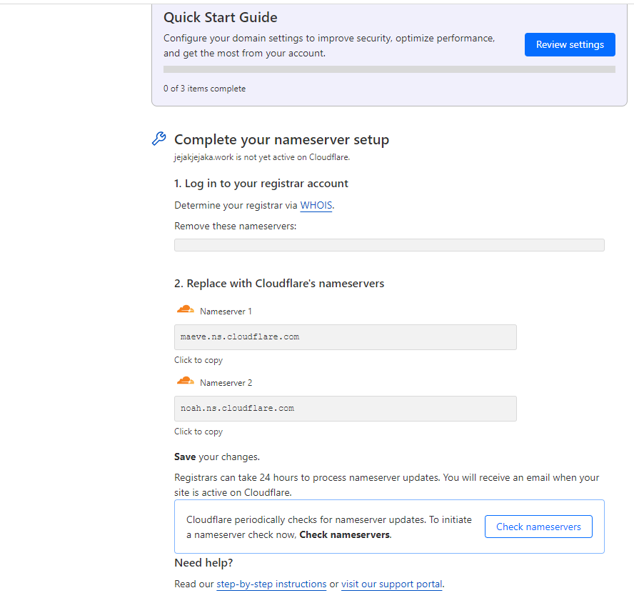

</li>
<li>At Niagahoster, we change the nameserver from default to Cloudflare nameserver

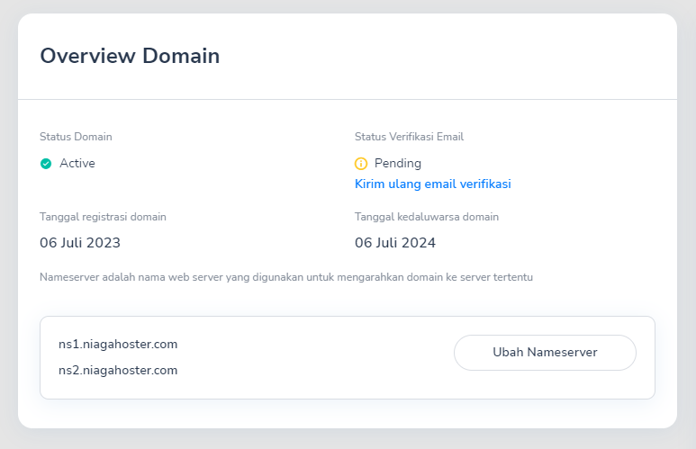
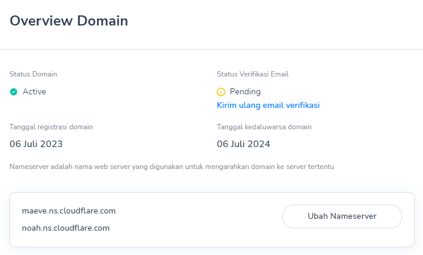

</li>
<li>After we set the nameserver from Niagahoster, we must set the DNS routing at DNS menu. For example, i set the DNS record with   
<ol>
<li>jejakjejaka.site</li>
<li>www.jejakjejaka.site</li>
 
</ol>

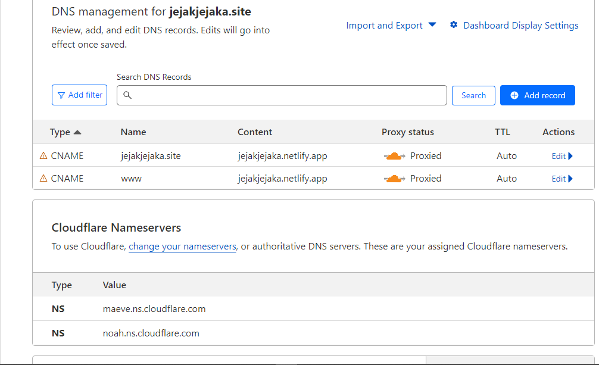
> NOTE  
> There are several types of DNS record type :  
> <ol>
> <li>A and AA : Map a domain name to one or multiple IPv4 or IPv6 address(es).</li> 
> <li>CNAME : Map a domain name to another (canonical) domain name. Can be used to resolve other record types present on the target domain name.</li> 
> <li>MX : A mail exchange (MX) record is required to deliver email to a mail server.</li> 
> <li>DKIM : A DomainKeys Identified Mail (DKIM) record ensures email authenticity by cryptographically signing emails.</li> 
> <li>SPF : A Sender Policy Framework (SPF) record lists authorized IP addresses and domains that can send email on behalf of your domain.</li> 
> <li>DMARC : A Domain-based Message Authentication Reporting and Conformance (DMARC) record helps generate aggregate reports about your email traffic and provide clear instructions for how email receivers should treat non-conforming emails.</li> 
> </ol>
 
Now we move to Netlify for setting our custom domain

</li> 
<li>At Netlify, choose our site and select Domain setting

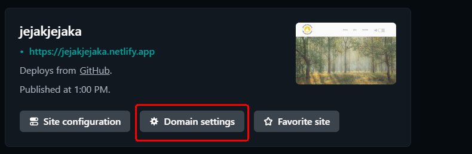

</li>
<li>Choose add domain

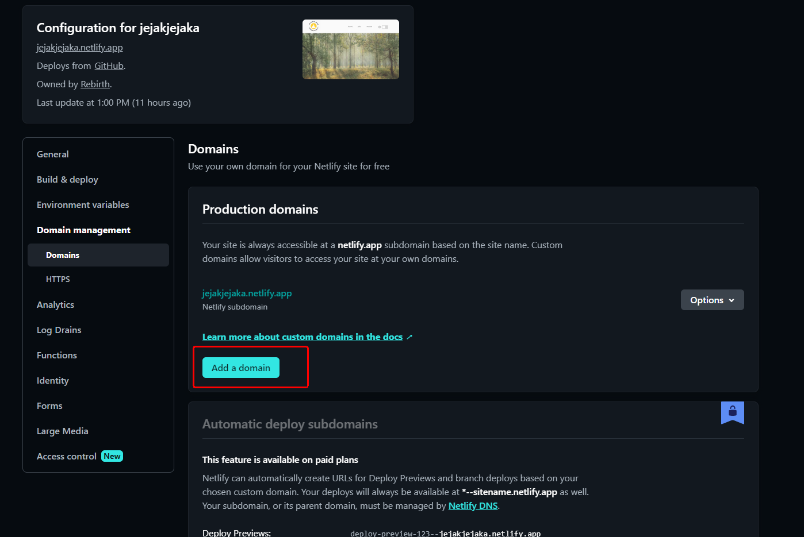

</li>
<li>Fill the input field with your custom domain. At this example, i fill with jejakjejaka.site

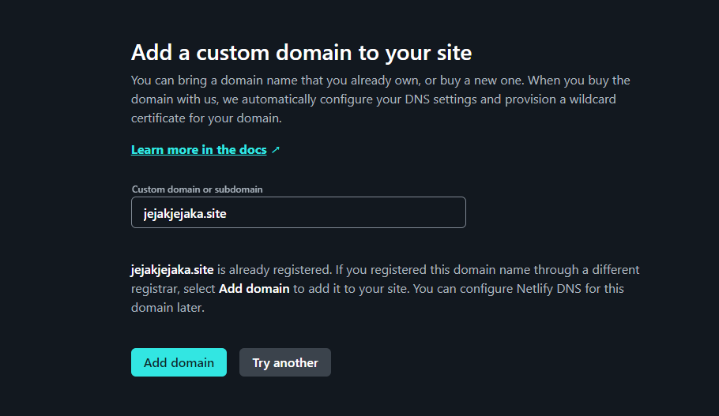

</li>
<li>Now we can access our website without using netlify domain.
We can use jejakjejaka.site  

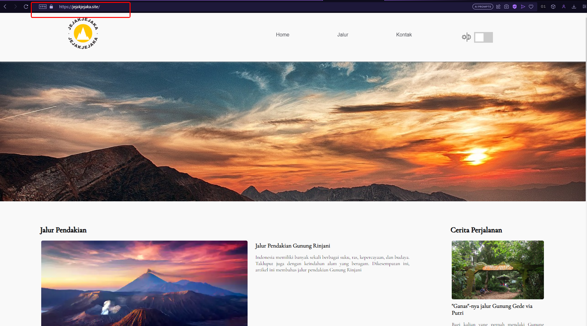

</li>
</ol>

## Reach Me Out

